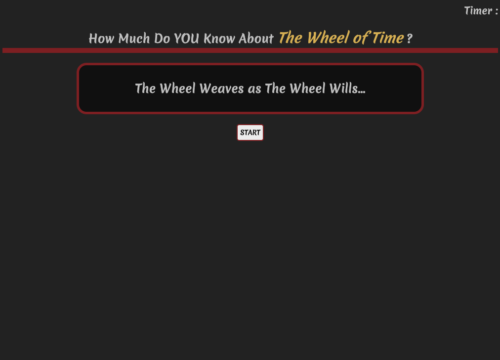

# hw4-Wheel Of Time Quiz

## Motivation

Have you ever read The Wheel of Time? if your answer was no, I have a homework assignment for you; go to your local book store or to Audible and buy them. If you have any interest in fantasy I promise you will not be disappointed. It is my favorite fantasy seiries and I love talking to people about it. I made this quiz to challenge my friends knowledge and prove that I am the ultimate Wheel of Time nerd.cle

## Future Fixes

In the future I would like to add some more functionality to the quiz including ordering the high scores list to display the ultimate champion (ME) and add more questions to further test our knowledge.

## Screenshot

## Deployed Site Link

Test your knowledge!!

https://elliscj.github.io/hw4-WOTquiz/

## License

MIT License

Copyright (c) [2021] [Cameron Ellis]

Permission is hereby granted, free of charge, to any person obtaining a copy
of this software and associated documentation files (the "Software"), to deal
in the Software without restriction, including without limitation the rights
to use, copy, modify, merge, publish, distribute, sublicense, and/or sell
copies of the Software, and to permit persons to whom the Software is
furnished to do so, subject to the following conditions:

The above copyright notice and this permission notice shall be included in all
copies or substantial portions of the Software.

THE SOFTWARE IS PROVIDED "AS IS", WITHOUT WARRANTY OF ANY KIND, EXPRESS OR
IMPLIED, INCLUDING BUT NOT LIMITED TO THE WARRANTIES OF MERCHANTABILITY,
FITNESS FOR A PARTICULAR PURPOSE AND NONINFRINGEMENT. IN NO EVENT SHALL THE
AUTHORS OR COPYRIGHT HOLDERS BE LIABLE FOR ANY CLAIM, DAMAGES OR OTHER
LIABILITY, WHETHER IN AN ACTION OF CONTRACT, TORT OR OTHERWISE, ARISING FROM,
OUT OF OR IN CONNECTION WITH THE SOFTWARE OR THE USE OR OTHER DEALINGS IN THE
SOFTWARE.
